# Chromascope

A high-fidelity audio analysis engine that extracts musical features for reactive generative art. Transform any audio into stunning, music-driven visualizations.

<p align="center">
  <em>Real-time audio-reactive kaleidoscopic visualization</em>
  <p align="center">
  <a href="https://youtu.be/CdsD9A3AVC8">
    
  <br>
  </a>
</p>
</p>

```
Audio File → Analysis Pipeline → Visual Driver Manifest → Kaleidoscope Video
```

## What It Does

This engine tries to *understand* the character of music by separating **percussive transients** (drums, attacks) from **harmonic textures** (melodies, chords). 
### Feature Extraction

| Feature | Description | Visual Application |
|---------|-------------|-------------------|
| **HPSS Separation** | Splits audio into harmonic and percussive components | Independent visual layers |
| **Beat Tracking** | Global BPM and beat timestamps | Sync animations to rhythm |
| **Onset Detection** | Identifies note attacks and transients | Trigger visual events |
| **RMS Energy** | Volume envelope (global + per-component) | Drive scale/intensity |
| **Frequency Bands** | Low (bass), Mid (vocals), High (cymbals) | Multi-band reactivity |
| **Chroma Features** | 12-bin pitch intensity (C, C#, D...) | Color mapping |
| **Spectral Centroid** | "Brightness" of the sound | Shape complexity |

### The Kaleidoscope Visualizer

Built-in visualizer with **twelve distinct styles**, each mapping audio features to unique transformations:

| Style | Description | Preview |
|-------|-------------|---------|
| **Geometric** | Orbiting polygons with radial symmetry | 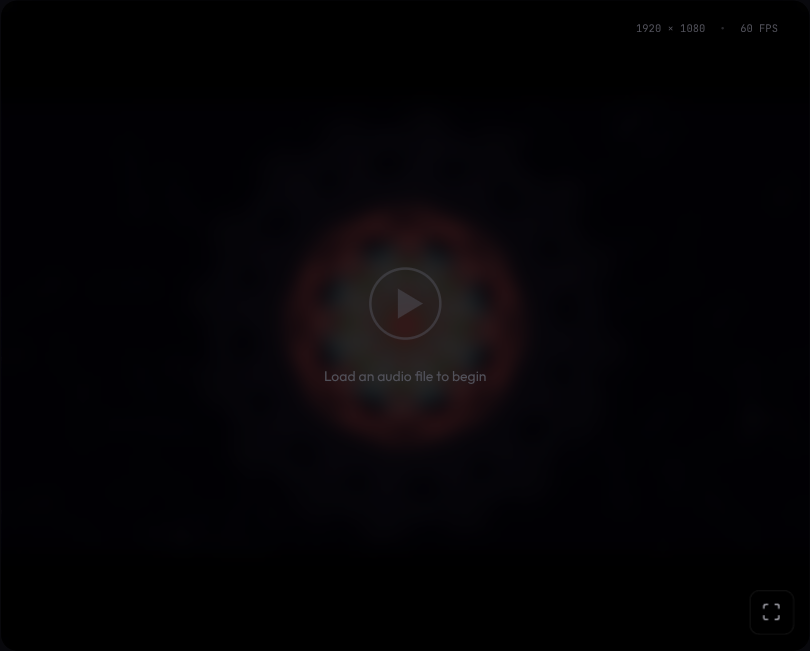 |
| **Glass** | Faceted kaleidoscope with gem tessellation and prismatic rays |  |
| **Flower** | Organic petal shapes with bezier curves | 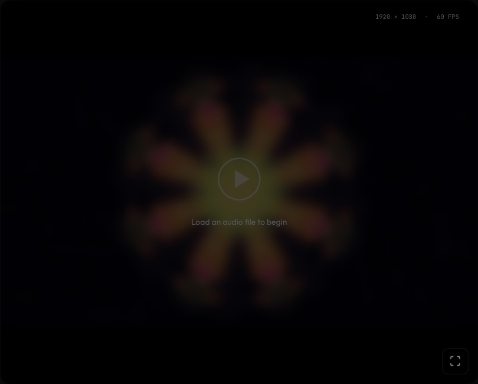 |
| **Spiral** | Hypnotic spiraling arms with flowing motion | 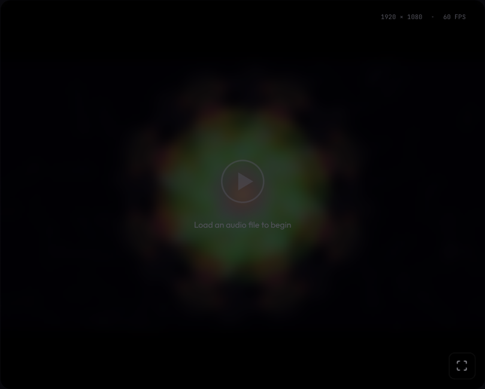 |
| **Circuit** | Hexagonal grid with glowing circuit traces | 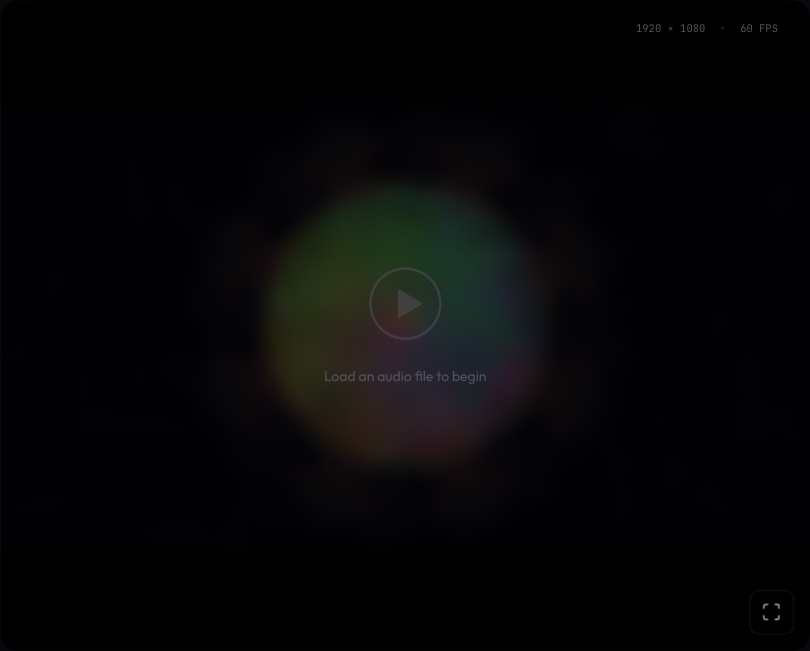 |
| **Fibonacci** | Golden spiral meets kaleidoscope with phyllotaxis patterns | 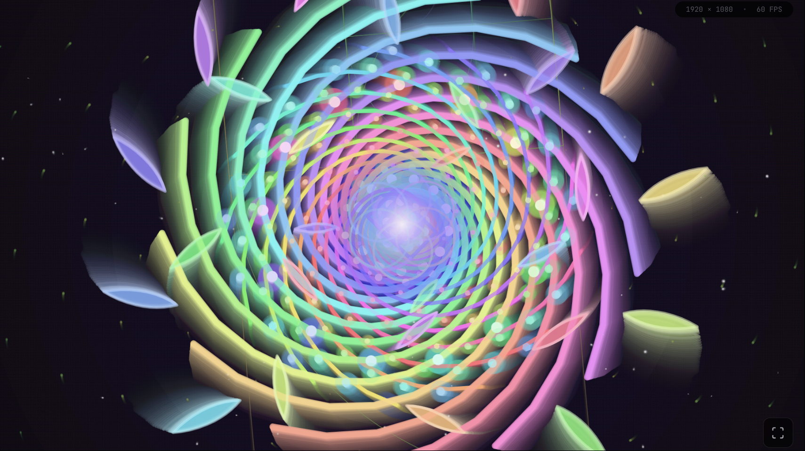 |
| **Spirit Molecule** | Hyperspace tunnel of non‑Euclidean, recursively folded geometry and neon fractals | 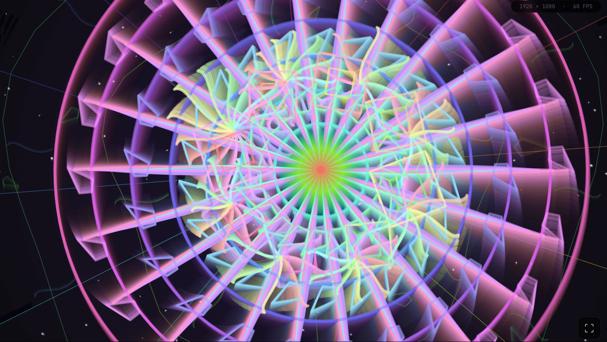 |
| **Sacred Geometry** | Mandala-style tiling, aperiodic patterns, and temple-like symmetry locks | 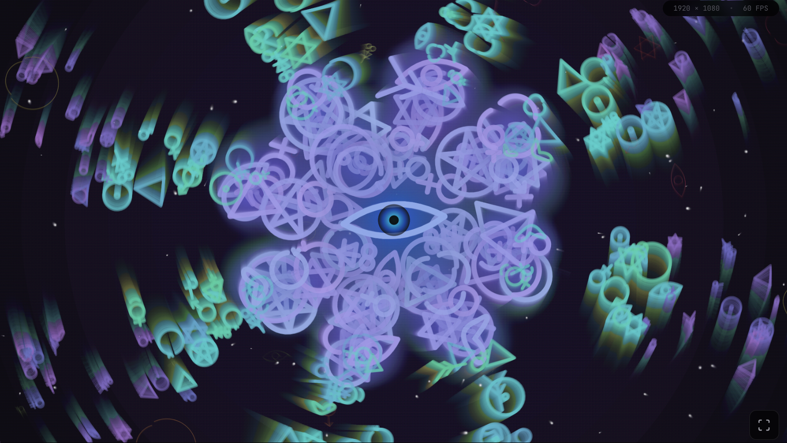 |
| **Mycelial** | Biomorphic fungal networks, bioluminescent growth, and spore-driven particle blooms | 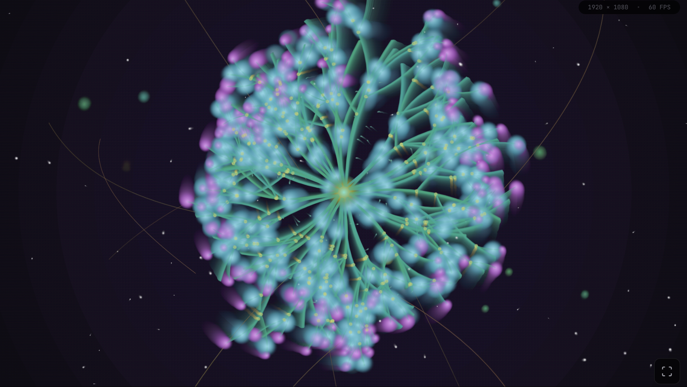 |
| **Fluid** | Chrome-like ferrofluid blobs with viscous metal ripples and specular reflections | 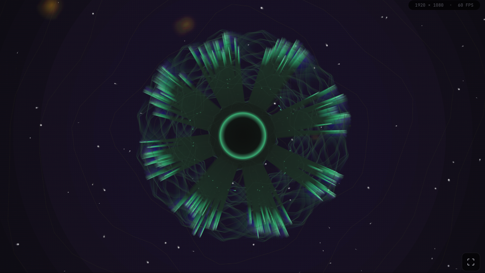 |
| **Orrery** | Chaotic orrery with brass planets, nested rings, and orbital trails | 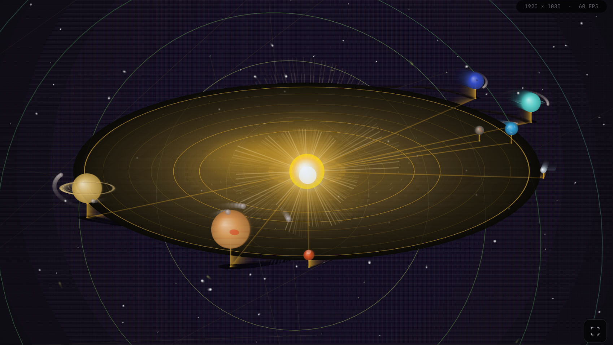 |
| **Quark** | Quantum field visualizer with probability clouds, entangled particles, and interference patterns | 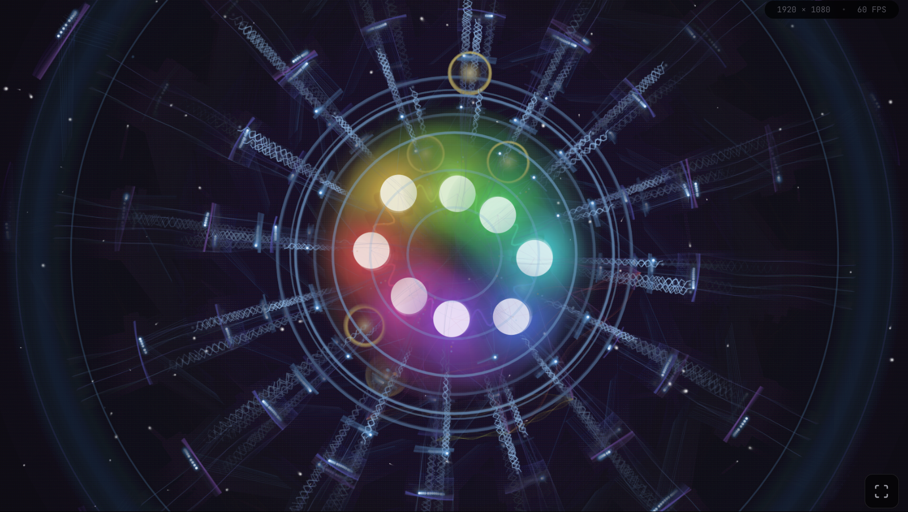 |

**Audio-to-Visual Mapping:**
- **Percussive Impact** → Shape pulsing (drums cause shapes to "kick")
- **Harmonic Energy** → Rotation speed (melodies drive smooth motion)
- **Spectral Brightness** → Polygon complexity (3 sides → 12 sides)
- **Dominant Pitch** → Hue colors (musical notes map to spectrum)

**Dynamic Background Effects:**
- Full-screen fractal kaleidoscope patterns that expand across the entire viewport
- Expanding radial geometry with mirrored triangles and polygon rings
- Gradient oscillation between two colors based on harmonic energy
- Floating particles that react to energy levels
- Expanding pulse rings on beat hits
- Smooth vignette for cinematic depth
- Fully configurable reactivity and color palette

### Chromascope Studio (Web UI)

A premium web-based interface designed for musicians:

- **Drag & drop** audio files
- **Real-time preview** with live canvas rendering
- **Rotary knob controls** that feel like studio hardware
- **Waveform timeline** with visual playhead
- **One-click export** to HD video

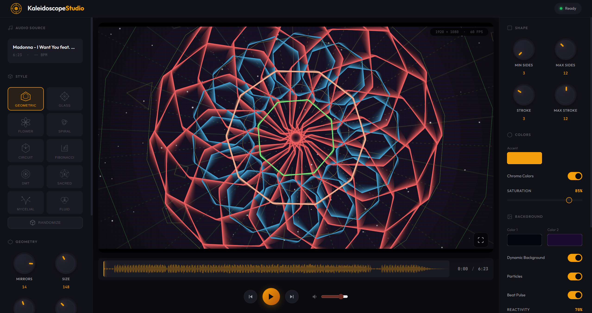

## Quick Start

For a step‑by‑step, musician‑friendly walkthrough of the Studio, CLI, and Python API, see the **[User Guide](docs/USER_GUIDE.md)**.

### Installation

```bash
# Clone the repository
git clone https://github.com/yourusername/chromascope.git
cd chromascope

# Create virtual environment
python3 -m venv .venv
source .venv/bin/activate

# Install with dependencies
pip install -e ".[dev]"
```

### Basic Usage

**Analyze audio and generate manifest:**

```python
from chromascope import AudioPipeline

pipeline = AudioPipeline(target_fps=60)
manifest = pipeline.process_to_manifest("your_song.mp3")

# Access frame data
for frame in manifest["frames"]:
    if frame["is_beat"]:
        print(f"Beat at {frame['time']:.2f}s - {frame['dominant_chroma']}")
```

**Render a kaleidoscope video:**

```python
from pathlib import Path
from chromascope.render_video import render_video

render_video(
    audio_path=Path("your_song.mp3"),
    output_path=Path("output.mp4"),
    width=1920,
    height=1080,
    fps=60,
)
```

### Command Line

```bash
# Analyze audio to JSON manifest
chromascope song.mp3 -o manifest.json --fps 60 --summary

# Render kaleidoscope video
python -m chromascope.render_video song.mp3 -o output.mp4
```

### Web Interface (Chromascope Studio)

```bash
# Start the web server
python frontend/server.py

# Open http://localhost:8080 in your browser
```

## Output Format

The Visual Driver Manifest is a JSON file with frame-by-frame data. It is
explicitly versioned via `schema_version` so renderers can safely evolve
alongside the analysis pipeline.

```json
{
  "metadata": {
    "bpm": 120.5,
    "duration": 180.0,
    "fps": 60,
    "n_frames": 10800,
    "version": "1.0",
    "schema_version": "1.0"
  },
  "frames": [
    {
      "frame_index": 0,
      "time": 0.0,
      "is_beat": true,
      "is_onset": true,

      "percussive_impact": 0.85,
      "harmonic_energy": 0.42,
      "global_energy": 0.65,
      "low_energy": 0.72,
      "mid_energy": 0.58,
      "high_energy": 0.31,
      "spectral_brightness": 0.44,

      "dominant_chroma": "G#",
      "chroma_values": {
        "C": 0.12, "C#": 0.08, "D": 0.15, "D#": 0.10, "E": 0.05, "F": 0.03,
        "F#": 0.02, "G": 0.25, "G#": 0.44, "A": 0.18, "A#": 0.09, "B": 0.06
      },

      "impact": 0.85,
      "fluidity": 0.42,
      "brightness": 0.44,
      "pitch_hue": 0.73,
      "texture": 0.45
    }
  ]
}
```

## Architecture

```
src/chromascope/
├── core/
│   ├── decomposer.py   # HPSS separation (harmonic/percussive)
│   ├── analyzer.py     # Feature extraction (beats, energy, chroma)
│   └── polisher.py     # Envelope smoothing & normalization
├── io/
│   └── exporter.py     # JSON/NumPy manifest export
├── visualizers/
│   └── kaleidoscope.py # Geometric visualization renderer
├── pipeline.py         # Main orchestration
├── render_video.py     # Video export with ffmpeg
└── cli.py              # Command-line interface

frontend/
├── index.html          # Main application
├── styles.css          # Studio-grade dark theme
├── app.js              # Visualization engine & controls
└── server.py           # Development server
```

### Pipeline Phases

1. **Decomposition** - HPSS separates harmonic (melody) from percussive (drums)
2. **Analysis** - Extract temporal, energy, and tonality features
3. **Polishing** - Apply attack/release envelopes for smooth visuals
4. **Export** - Generate FPS-aligned manifest for rendering

## Configuration

### Pipeline Options

```python
from chromascope import AudioPipeline
from chromascope.core.polisher import EnvelopeParams

pipeline = AudioPipeline(
    target_fps=60,              # Output frame rate
    sample_rate=22050,          # Analysis sample rate
    hpss_margin=(1.0, 1.0),     # HPSS separation strength
    impact_envelope=EnvelopeParams(
        attack_ms=0.0,          # Instant attack for punchy hits
        release_ms=200.0,       # 200ms decay for "glow" effect
    ),
    energy_envelope=EnvelopeParams(
        attack_ms=50.0,         # Smooth attack
        release_ms=300.0,       # Gradual release
    ),
)
```

### Kaleidoscope Options

```python
from chromascope.visualizers.kaleidoscope import KaleidoscopeConfig

config = KaleidoscopeConfig(
    width=1920,
    height=1080,
    fps=60,
    num_mirrors=8,        # Radial symmetry count
    trail_alpha=40,       # Motion blur persistence (0-255)
    base_radius=150.0,    # Base shape size
    max_scale=1.8,        # Maximum pulse scale
    min_sides=3,          # Triangle minimum
    max_sides=12,         # Dodecagon maximum
)
```

## Requirements

- Python 3.10+
- FFmpeg (for video export)
- ~500MB disk space per minute of HD video

### Dependencies

- `librosa` - Audio analysis
- `numpy` - Numerical operations
- `scipy` - Signal processing
- `pygame` - Frame rendering
- `Pillow` - Image handling
- `moviepy` - Video composition (optional)

## Development

```bash
# Install dev dependencies
pip install -e ".[dev]"

# Run tests
pytest tests/ -v

# Run with coverage
pytest tests/ --cov=src/chromascope --cov-report=term-missing
```

### Test Coverage

The test suite includes 52 tests covering:
- HPSS decomposition accuracy
- Feature extraction validation
- Envelope smoothing behavior
- Manifest schema compliance
- Full pipeline integration

## Use Cases

- **Music Videos** - Generate reactive visuals for tracks
- **Live Performance** - Real-time audio-reactive graphics
- **Art Installations** - Ambient visualizations
- **Game Development** - Music-driven game mechanics
- **Research** - Music information retrieval

## License

MIT License - See [LICENSE](LICENSE) for details.

---

*Built with the philosophy that high-quality visualization isn't about raw data—it's about **intent**.*
